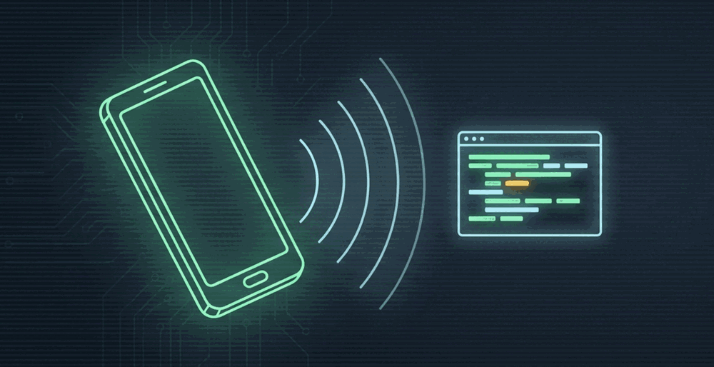
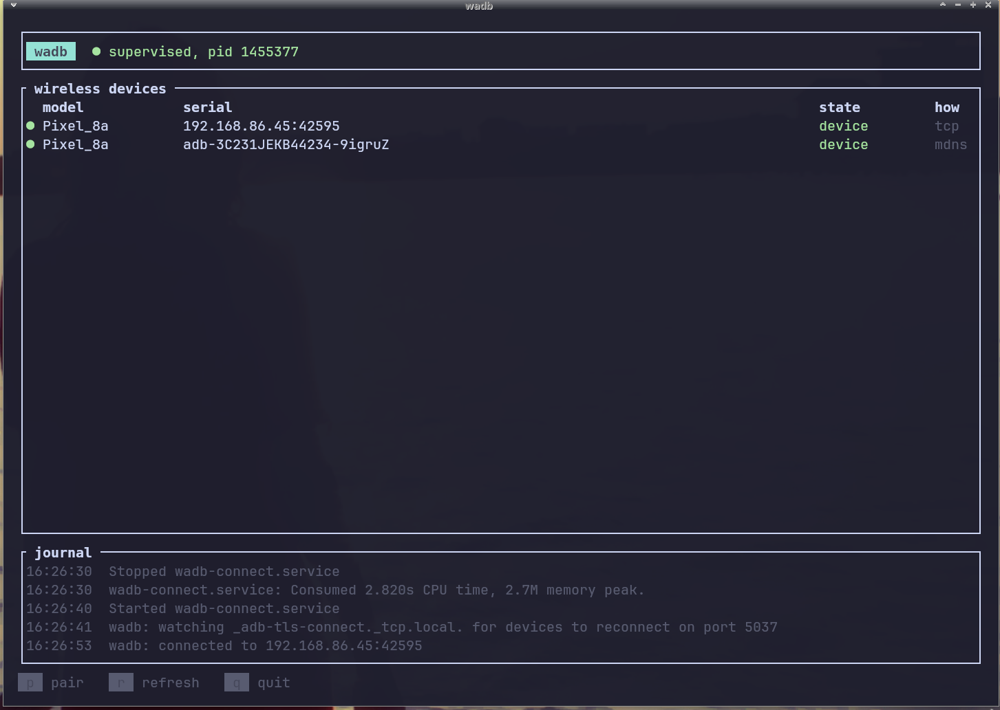

<p align="center">
  
</p>

<h1 align="center">wadb</h1>

<p align="center">
  Keeps the ADB server running on Linux so paired Android phones stay available for
  wireless debugging, without keeping Android Studio open.
</p>

<p align="center">
  <a href="https://github.com/hamen/wadb/actions"></a>
  
  
</p>

---

Pair once by scanning a QR code in your terminal. After that, `wadb` brings the phone back
whenever the connection drops — a crash, a suspend, Android Studio quitting, or anyone running
`adb kill-server`.

<p align="center">
  
</p>

The same phone appears twice above, on purpose: once as `192.168.86.45:42595` after an explicit
connect, and once under its mDNS name, on an occasion when adb's own discovery did win the socket
race (see below for why it often does not). They are two
transports to one handset, and `wadb` shows both rather than guessing which to hide.

## What it actually does

```
$ adb kill-server
                              ← systemd restarts the server
                              ← wadb sees the phone advertising itself
                              ← wadb reconnects it
t+6s  device is back
```

No new QR scan, no manual `adb connect`.

Two `systemd --user` units do the work. **`wadb.service`** supervises the standard adb server on
`127.0.0.1:5037` and restarts it if anything stops it. **`wadb-connect.service`** watches for
wireless devices and reconnects them. Android Studio, the `adb` command line and every other adb client see the same
devices — `wadb` owns nothing they don't.

## Requirements

- Linux with a `systemd --user` session
- **Android SDK Platform-Tools.** Not any `adb` — see below
- Your computer and phone on the same Wi-Fi network
- **Wireless debugging** enabled in the phone's Developer options

## Install

```sh
cargo install --path .
wadb install     # checks your adb, writes and starts both units
wadb             # the terminal UI
```

Press `p`, then on the phone open **Settings → Developer options → Wireless debugging →
Pair device with QR code** and scan the code in your terminal.

If your phone can't scan a screen, use the six-digit code instead:

```sh
wadb pair 192.168.86.45:37219    # ip:port from the phone's Wireless debugging screen
```

> Scan the QR from the **Wireless debugging** screen, not your camera app. A camera sees
> `WIFI:T:ADB;…`, assumes it's a Wi-Fi network, and rejects it. Only Android's own scanner
> understands the format.

## Commands

| | |
|---|---|
| `wadb` | the terminal UI (prints `status` when stdout isn't a terminal) |
| `wadb install` | check adb, write and start both units |
| `wadb status` | units, server, adb binary, mDNS discovery, devices |
| `wadb pair <ip:port>` | pair with a typed six-digit code |
| `wadb connect` | reconnect every advertised device once, by hand |
| `wadb daemon` | the reconnect watcher; this is what `wadb-connect.service` runs |
| `wadb takeover` | ask a foreign adb server to stop so the unit can take the port |
| `wadb tray` | a panel icon: is a phone attached, the device list, pairing and reconnect |
| `wadb uninstall` | stop and remove both units |

## Panel icon

`wadb tray` puts an icon in the panel, so you can see whether the phone is attached without
opening a terminal. It is a StatusNotifierItem on the session bus, which XFCE 4.16 and later,
KDE Plasma, and GNOME with the AppIndicator extension all show. Verified by hand on XFCE 4.20
only; the other two are reasoned from the specification, not tested, and the icon is sent as a
pixmap, which is the fallback every host implements.

The icon answers one question, *is a phone attached?* It is a phone, drawn by wadb rather than
taken from your icon theme, with its screen lit and green when a wireless device is attached and
dark and grey when none is. Why nothing is attached is in the tooltip and the first menu line,
in words.

It is drawn rather than themed for two reasons. Asking the theme for the obvious names would put
`network-wireless-*` on your panel, which is what your network indicator already shows — one of
those next to the other is genuinely misleading. And no icon theme ships a phone with an on/off
pair: elementary-xfce, Adwaita and Yaru all have `phone-symbolic` and friends, and at 22 px they
are the same slab. A drawn icon does not follow your theme's colours, so the two are mid-tone and
meant to read on a light panel and a dark one.

A left click opens the menu:

- the unit's state, and the outcome of the last action you ran from the menu
- one line per wireless device, with `(offline)` or `(unauthorized)` when adb says so
- **Open wadb to pair…** opens the terminal UI; press `p` there. See *Which terminal* below
- **Reconnect now** does one pass of the watcher, ignoring any backoff
- **Take over the port**, shown when another adb holds the port and the unit is installed
- **Quit**

### Which terminal, and how big

The terminal UI needs 78x30 to draw the pairing QR, and below that it says so instead. Opening it
from a menu should not need you to resize a window first, so wadb asks for 80x32 — and to ask, it
has to know which terminal it is talking to.

It takes the first of these that works:

1. `$TERMINAL`. Arguments are allowed. If the last word is `-e`, `-x`, `--command` or `--`, wadb
   takes that as you having written the invocation yourself and appends only the path to `wadb` —
   no size arguments, no second separator.
2. Your desktop's own record: `xdg-terminals.list`, per the freedesktop Default Terminal Execution
   specification, searched under `$XDG_CONFIG_HOME` and `$XDG_CONFIG_DIRS`, with the desktop-specific
   file preferred. This is where a preference set once actually lives, which is why it outranks the
   next two.
3. `x-terminal-emulator`, when the alternative resolves to a terminal wadb can size.
4. kitty, alacritty, foot, xfce4-terminal, konsole, gnome-terminal, xterm — the ones whose size
   flags wadb knows.
5. `x-terminal-emulator` otherwise, unsized.

Note that `x-terminal-emulator` is a *distribution* alternative rather than your preference. On a
Debian-family machine it is usually GNOME Terminal by package priority, whatever else you have
installed, which is why it is not tried first.

The size is a request. A tiling window manager ignores it, and so does any terminal not in the
list above — the "terminal too small" screen is the backstop. If a terminal rejects the size
arguments outright, wadb notices it exit and opens it again without them, so a wrong guess costs
the size and never the window.

Until `wadb install` has run, the icon stays offline and the menu says so: the tray reads nothing
from a port that is not ours. To start it with your session, add `wadb tray` to your desktop's
autostart by hand; it can start before the panel does and registers when the panel comes up. A
session with no StatusNotifier host, such as a bare X session with no panel, shows nothing, and
two `wadb tray` processes show two icons.

## Why the adb binary matters

adb is *supposed* to reconnect trusted wireless devices itself: with an mDNS backend it browses
`_adb-tls-connect._tcp` and auto-connects the services named in `$ADB_MDNS_AUTO_CONNECT`
(default `adb-tls-connect`). Distro builds frequently have no backend
at all:

| adb | `mdns check` |
|---|---|
| Android SDK Platform-Tools 36.0.0 | `mdns daemon version [Openscreen discovery 0.0.0]` |
| Debian/Ubuntu `adb` 34.0.5 | *(nothing)* |

And having the backend is **not sufficient**. Only one adb server can hold the host's mDNS socket,
and on a machine running `avahi-daemon` adb frequently loses that race — silently. Measured here:
after `adb kill-server` the device never came back, `adb mdns services` stayed empty on a server
that had been up for minutes, and at that same instant both `avahi-browse` and `wadb`'s own browser
could see the phone.

So `wadb` does the reconnect itself, using the only mDNS implementation on the host that works.
That is adb's own documented behaviour, performed on its behalf. `adb connect` succeeds only for a
device that already trusts this host's key, so nobody else's phone can be attached this way.

`wadb install` still refuses a backend-less adb, for a narrower reason: such a build is also first
on your `PATH`, and the moment any tool runs it while the supervised server is down, it forks a
replacement with no mDNS and takes the port.

Checking this correctly is subtler than it looks. **`adb mdns check` reports the state of whichever
*server* answers, not of the binary you invoked** — point Debian's adb at an SDK server and it will
happily claim an openscreen daemon it does not have. So `wadb install` starts the candidate binary
as its own server on a scratch port and questions *that* server, then tears it down. And because
only one server can hold the mDNS socket, a probe is only meaningful when nothing else holds it: if
a running server cannot be attributed to the candidate, `wadb install` reports that the answer
cannot be established and asks you to restart it, rather than guessing.

## Notes and limitations

- **Only wireless devices are listed.** USB devices and emulators stay available to every adb
  client; they're just not what this tool is about.
- **`wadb` never kills an adb server it doesn't own.** If another server holds the port it says so
  and offers `wadb takeover`, which sends adb's own cooperative `kill-server` request. Nothing is
  ever signalled directly.
- `wadb uninstall` stops the server the units owned, which drops the USB and emulator sessions
  attached to it. The next adb command from any tool starts a fresh server — possibly one with no
  mDNS backend.
- Without `loginctl enable-linger`, a `systemd --user` unit stops at your last logout.
  `wadb install` tells you if lingering is off.
- Local Wi-Fi only. There is no remote relay.
- `wadb` never installs or replaces platform-tools.

## Security

The pairing password is generated from the OS random source, written to `adb pair` on **stdin
only** — never argv, which is world-readable through `/proc/<pid>/cmdline` — and zeroized after
use, including on early returns.

Be aware this is narrower than "the password is safe": for the seconds it is live it also exists in
the QR matrix, in the rendered terminal buffer, and in your terminal's scrollback. It is a
single-use credential with a short life, and `wadb` does not persist it, but it is not a secret
held only in locked memory.

`wadb` stores nothing — no device list, no keys, no pairing state. Device state is always read live
from the adb server. It uses your existing adb server, keys and pairings — the only long-running
processes are the two `systemd --user` units described above, and there is no third-party relay.

## Credits

An independent Rust rewrite for Linux, inspired by [wADB](https://github.com/c5inco/wADB) by Chris
Sinco, a macOS menu-bar app doing the same job. No code is shared between them.

## License

Apache-2.0. See [LICENSE](LICENSE) and [NOTICE](NOTICE).
